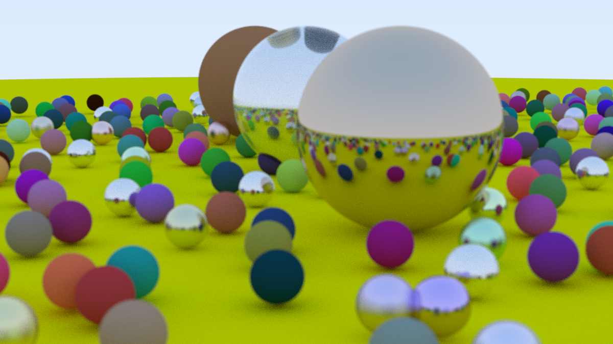

# Tracer

A rust implementation of the book [Ray Tracing in One Weekend](https://raytracing.github.io/).

## Lets talk output first

This is the result I got after the final run. I am sure I could have made some more improvements but I am quite satisfied with this.


The output on the book is this.


As you can see, there are a few problems with my image which leads us to...

## Errors

First let me address that the differences in colors and position of balls are not errors.
They are randomized.

```rust
    for j in -11..11 {
        for i in -11..11 {
            let choose_mat = rtweeknd::random();
            let center = Point::new(
                j as f64 + 0.9 * rtweeknd::random(),
                0.2,
                i as f64 + 0.9 * rtweeknd::random(),
            );

            if (center - Point::new(4.0, 0.2, 0.0)).length() > 0.9 {
                let sphere_mat: Rc<dyn Material> = if choose_mat < 0.8 {
                    Rc::new(Lambertian::new(Color::random() * Color::random()))
                } else if choose_mat < 0.95 {
                    Rc::new(Metal::new(
                        Color::random_in_range(0.5, 1.0),
                        rtweeknd::random_in_range(0.0, 0.5),
                    ))
                } else {
                    Rc::new(Dielectric::new(1.5))
                };
                world.add(Sphere::new(center, 0.2, Some(sphere_mat)));
            }
        }
    }
```

The first notable error can be seen in the giant ball in the middle. The material for this ball is dielectric.
The reflection on it is inverted. I probably forgot a - somewhere or added an extra.

Another error you might notice is that there aren't any glass balls in my image. Well, there are. They
are just different from what they are supposed to be. Now that I look closely, metal and glass balls exactly
same. You can't tell which one is which. I can only assume that the silver colored ones are the glass
ones as they are the same colored as the giant glass ball. I am sure the problem and solution for
this is stupidely simple and I just haven't looked enough.


## Thoughts
I had a lot of fun doing this. It was an easy project with a book to follow along. But I wasn't just 
mindlessly following along (I was kinda in case of the whole raytracing process although I have learned
a few things about how they work). But the most fun part and also why I decided to do this project was the
implementation in Rust part.

## References
[_Ray Tracing in One Weekend_](https://raytracing.github.io/books/RayTracingInOneWeekend.html)
